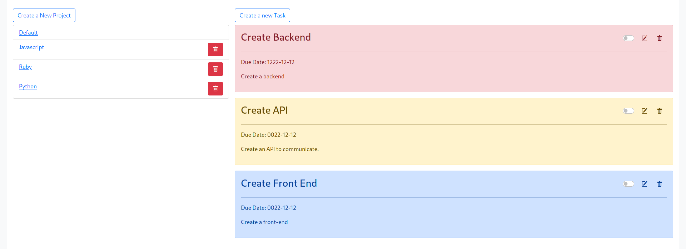

# Project Name

A task manager app where you can create various projects and add tasks assosiated with that project. 



## Built With

- Javascript
- Bootstrap
- Webpack

## Live Demo

[Live Demo Link](https://sinansevgi.github.io/task_manager)


## Getting Started

Please follow the instructions below to clone the application and use it on your local machine.

### Prerequisites
Please make sure you have node.js installed on your local machine. 

### Setup

To clone
```
git clone https://github.com/sinansevgi/task_manager
```
Navigate to the project folder
```
cd task_manager
```

### Install

Run NPM
```
npm install
```
Run webpack to bundle the project and run live-server
```
npm run start:dev
```

### Usage

To create your own project, click the Create New Project button on the left. To add tasks for that project, click Create New Task Button on the top. To edit or delete the task, Please use the Pen icon or Delete icon. The background of task reflects the priority of task. Blue background means the task is not urgent, Yellow means the task is important, and the red background means that the task is urgent

## Authors
👤 **Sinan Sevgi**
- GitHub: [@sinansevgi](https://github.com/sinansevgi)
- LinkedIn: [@sinansevgi](https://www.linkedin.com/in/sinansevgi/)
- Twitter: [@nativeofcybers1](https://twitter.com/nativeofcybers1)
- Portfolio: [Website](https://sinansevgi.com)

👤 **Anas Siddiqui**

- GitHub: [Anas Siddiqui](https://github.com/smcommits)
- LinkedIn [Anas Siddiqui](https://www.linkedin.com/in/sm-anas/)


## 🤝 Contributing

Contributions, issues, and feature requests are welcome!

Feel free to check the [issues page](issues/).

## Show your support

Give a ⭐️ if you like this project!

## Acknowledgments

The Odin Project
